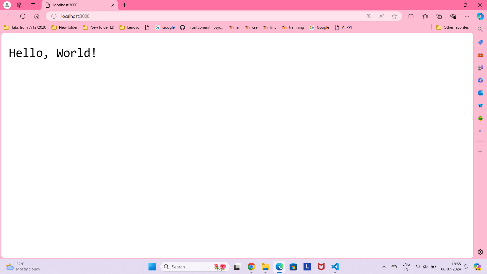
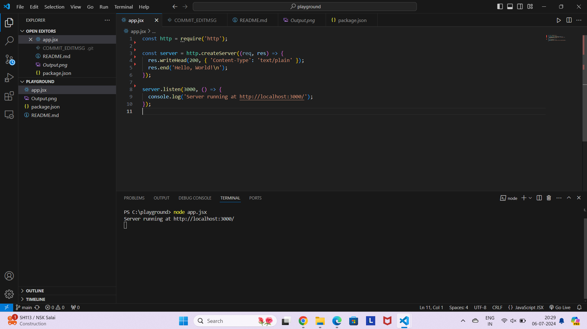

# nodejs-hello-world-server


1. .  Create a Node.js HTTP server that listens on port 3000 and responds with "Hello, World!" to any request.

# Steps:
1.	Initialize a Node.js project (if not already initialized)
2.	Create the server script
3.	Run the server
# Explanation:
1.	Import the HTTP module:
●	const http = require('http');
2.	Create an HTTP server:
●	const server = http.createServer((req, res) => { ... });
●	This creates an HTTP server that calls the provided callback function whenever a request is made to the server.
3.	Handle the request and response:
●	res.writeHead(200, { 'Content-Type': 'text/plain' });
●	This sets the status code to 200 (OK) and the content type to text/plain.
●	res.end('Hello, World!\n');
●	This ends the response and sends the string "Hello, World!" to the client.
4.	Start the server:
●	server.listen(3000, '127.0.0.1', () => { ... });
●	This starts the server and listens for connections on port 3000. The callback function logs a message when the server starts listening.
# Test the Server:
Open a web browser and navigate to http://localhost:3000. You should see the message "Hello, World!" displayed on the page.
# Code
```
const http = require('http');

const server = http.createServer((req, res) => {
  res.writeHead(200, { 'Content-Type': 'text/plain' });
  res.end('Hello, World!\n');
});

server.listen(3000, () => {
  console.log('Server running at http://localhost:3000/');
});

```

# OUTPUT

